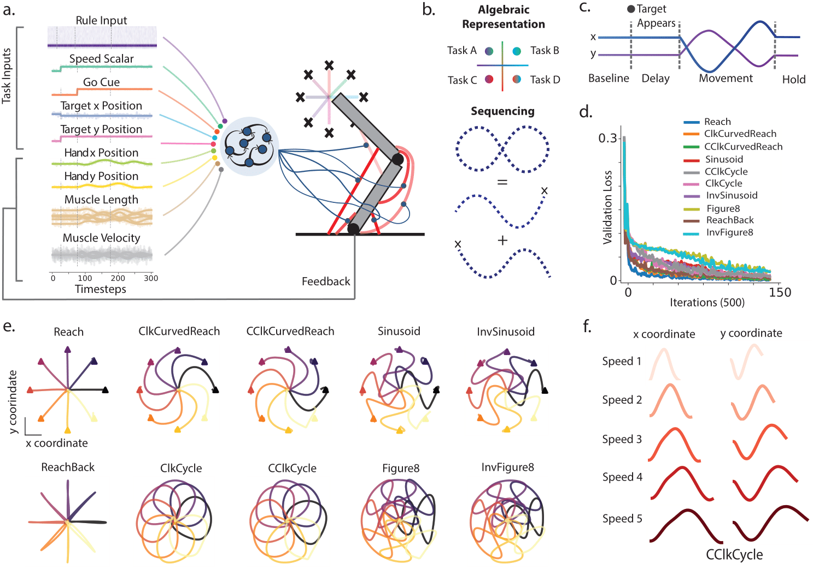

# Multitasking Recurrent Networks Utilize Compositional Strategies for Control of Movement

RNNs and GRUs trained to perform multiple delayed‐reach/movement tasks with biomechanical feedback, and analyses of how neural and muscular manifolds compose across tasks. Environments are built on top of motornet’s 2‑link, 6‑muscle arm, and networks are implemented with a modular multi‑region RNN (mRNNTorch).

Link to Biorxiv: https://www.biorxiv.org/content/10.1101/2025.09.10.675375v1

The project provides:
- Training scripts for multi‑task models and transfer/compositional variants
- A library of delayed movement environments (reach, circles, sinusoid, figure‑8, and variants)
- Analysis scripts for PCA/jPCA, principal angles, VAF ratios, fixed‑point structure, decoding, and performance tracking
- Reproducible experiment runners (CLI) and SLURM templates

## Why this repo
- Study compositionality: how activity/manifolds for different tasks combine (delay vs movement; extension vs retraction)
- Evaluate generalization: training on subsets and transferring to held‑out tasks by adding rule inputs
- Inspect dynamics: fixed points, flow fields, eigenstructure, trajectories in low‑dim spaces

## Repository Structure
- `train.py`: Core training loops (multi‑task baseline, compositional env, subset/transfer variants). Saves `hp.json`, losses, and best checkpoints.
- `envs.py`: Task family on motornet arm. Key classes include `DlyHalfReach`, `DlyHalfCircleClk/CClk`, `DlySinusoid/Inv`, `DlyFullReach`, `DlyFullCircleClk/CClk`, `DlyFigure8/Inv`, and `ComposableEnv`.
- `model.py`: Policies: `RNNPolicy` (mRNNTorch backend), `GRUPolicy`, and `OrthogonalNet` for stitching per‑task regions.
- `experiments/run_train.py`: CLI entry for training presets (model size/activation; subset/held‑out transfer; compositional base).
- `experiments/exp_utils.py`: Utilities to load models, run episodes (`_test`), craft composite inputs, and compute metrics.
- `experiments/pcs.py`: PCA/jPCA visualizations and variance curves.
- `experiments/performance.py`: Plot validation curves across environments and transfer settings.
- `experiments/compositionality.py`: Compositionality analyses: principal angles, VAF ratios, fixed‑point interpolation, decoding, and more.
- `analysis/`: Fixed‑point finder, manifold tools, clustering, jPCA, plotting utils, and TME helpers.
- `mRNNTorch/`: Lightweight, local mRNN builder used by `RNNPolicy`.
- `checkpoints/`, `results/`, `logs/`: Output directories (created as needed).

## Installation
Prereqs: Python 3.9+, PyTorch, NumPy. For training only, you mainly need motornet and plotting deps. For full analyses, install extra scientific packages.

1) Create an environment and install core deps
- `pip install torch numpy matplotlib tqdm configargparse`
- `pip install motornet`  (motornet’s Mujoco‑based 2‑link arm; CPU mode is used here)

2) Recommended analysis deps (optional but used by many scripts)
- `pip install scikit-learn seaborn scipy pandas`
- TME and dPCA (optional):
  - `tensor_maximum_entropy` (see its repo for install)
  - `dPCA` (Machens lab implementation or equivalent)

Note: `mRNNTorch` ships in this repo; no separate install required.

## Quick Start
Train a 256‑unit softplus RNN on all tasks and save to `checkpoints/rnn256_softplus_sd1e-3_ma1e-2`:
- `python experiments/run_train.py --experiment train_rnn256_softplus`

Continue training an existing model:
- `python experiments/run_train.py --experiment continue_training --model_name rnn256_softplus_sd1e-3_ma1e-2`

Run a transfer (held‑out) training variant (fine‑tunes only new rule inputs):
- `python experiments/run_train.py --experiment run_train_subsets_held_out_base_model`

Train on a compositional environment with saved loss curves:
- `python experiments/run_train.py --experiment run_train_compositional_env_base_model`

SLURM example templates are provided in `job.sh` and `job_interp_fp.sh` and use `config.txt` for arguments.

## Configuration
Many experiment runners accept a config file via `--config` (see `config.py`):
- `config.txt`
  - `model_name=...` (checkpoint subdir and `.pth` filename base)
  - `experiment=...` (one of the `experiments/run_train.py` entry names, e.g., `train_rnn256_softplus`, `continue_training`)

Example:
- `python experiments/run_train.py --config config.txt`

## Environments and Inputs
Each environment class defines epochs (`stable`, `delay`, `movement`, `hold`), random speeds, and a 10‑dim one‑hot rule input. Network observations concatenate:
- Rule input (10‑D), speed scalar, go cue, visual target signal(s), vision/proprioception feedback, and stacked recent actions. Default `inp_size` is 28 (see `train.DEF_HP`).

Available tasks include half/full reaches, clockwise/counter‑clockwise circles, sinusoid and inverse, and figure‑8 and inverse. `ComposableEnv` mixes forward and backward “motifs” to probe compositional generalization.

## What gets saved
- Checkpoints: `checkpoints/<model_name>/<model_name>.pth` (best so far) and `hp.json`.
- Loss logs: `checkpoints/<model_name>/losses.txt`, optional `performance.txt` during eval.
- Plots/results: `results/<model_name>/...` grouped by analysis type.

## Analyses and Plots
Most analysis files expose functions you can call from Python. A few examples:

Neural and muscle PCA (3D trajectories and variance curves):
- `from experiments.pcs import plot_neural_pca3d_movement, plot_motor_pca3d_movement`
- `plot_neural_pca3d_movement("rnn256_softplus_sd1e-3_ma1e-2")`

Performance curves across environments:
- `from experiments.performance import plot_test_performance`
- `plot_test_performance("rnn256_softplus_sd1e-3_ma1e-2")`

Compositionality metrics (principal angles, VAF ratios, decoding, fixed‑point interpolation):
- `from experiments.compositionality import plot_interpolated_fps_halfreach_fullreach_movement`
- `plot_interpolated_fps_halfreach_fullreach_movement("rnn256_softplus_sd1e-3_ma1e-2")`

Lower‑level evaluation helper (single rollout):
- `from experiments.exp_utils import _test, env_dict`
- `trial = _test("checkpoints/rnn256_softplus_sd1e-3_ma1e-2", "rnn256_softplus_sd1e-3_ma1e-2.pth", {"batch_size": 8, "reach_conds": np.arange(0,32,4), "speed_cond": 5, "delay_cond": 1}, env=env_dict["DlyHalfReach"])`

Principal angles and VAF ratio helpers live in `analysis/manifold.py`.

## Tips and Common Patterns
- Hidden size and activation: set via `hp` dict in the chosen runner or by editing `train.DEF_HP`.
- Evaluations: `train.py` prints per‑task validation losses and saves the best checkpoint automatically.
- Transfer learning: held‑out runners rebuild the input layer to add new “rule inputs” and freeze other weights (see `model.RNNPolicy` new‑rule path).
- Gradient stability: training uses grad‑norm clipping at 1.0.

## Troubleshooting
- Missing packages: some analyses import optional dependencies (`tensor_maximum_entropy`, `dPCA`). Install them only if you run those specific analyses.
- Motornet/Mujoco: this repo uses motornet’s CPU environments; ensure `motornet` is installed and importable.
- Large plots: figures are saved under `results/` with `.png`/`.pdf` via `utils.save_fig`.

## Acknowledgments
- motornet: biomechanics and task framework for motor control
- mRNNTorch: modular multi‑region RNN builder used for policy networks

## Citation
If you use this code, please cite this repository and the motornet and mRNNTorch libraries as appropriate.
